[AWS Automated language translation pipeline]{.underline}

### **[Project Overview]{.underline}**

*This project implements a **serverless language translation pipeline**
using AWS. The goal is to **automatically translate uploaded text
files** from an input S3 bucket and **store the translated output** in a
separate output bucket using Amazon Translate and AWS Lambda.*

1.  

Workflow diagram

+\-\-\-\-\-\-\-\-\-\-\-\-\-\-\--+

\| User Uploads \|

+\-\-\-\-\-\--+\-\-\-\-\-\-\--+

\|

v

+\-\-\-\-\-\--+\-\-\-\-\-\-\--+ Triggers

\| S3 Input Bucket \|\-\-\-\-\-\-\-\-\-\-\-\-\-\-\--+

\| reciever-buck002 \| \|

+\-\-\-\-\-\-\-\-\-\-\-\-\-\-\-\-\--+ \|

v

+\-\-\-\-\-\-\-\-\-\-\-\-\-\-\-\-\--+

\| Lambda Function \|

\| lang-translator \|

+\-\-\-\-\-\-\--+\-\-\-\-\-\-\-\--+

\|

Uses AWS Translate \|

v

+\-\-\-\-\-\-\-\-\-\-\-\-\-\-\-\-\-\-\-\--+

\| S3 Output Bucket \|

\| taker-buck001 \|

+\-\-\-\-\-\-\-\-\-\-\-\-\-\-\-\-\-\-\-\-\--+

**Project Structure**

translation-pipeline/

│

├── terraform/

│ ├── main.tf \# All infrastructure defined here

│ ├── providers.tf

│

├── lambda/

│ ├── index.py \# Lambda function logic

│ └── lambda_function.zip \# Zipped package for deployment

│

├── test/

│ └── test_input.json \# Sample input file for testing

│

└── README.md \# Project documentation

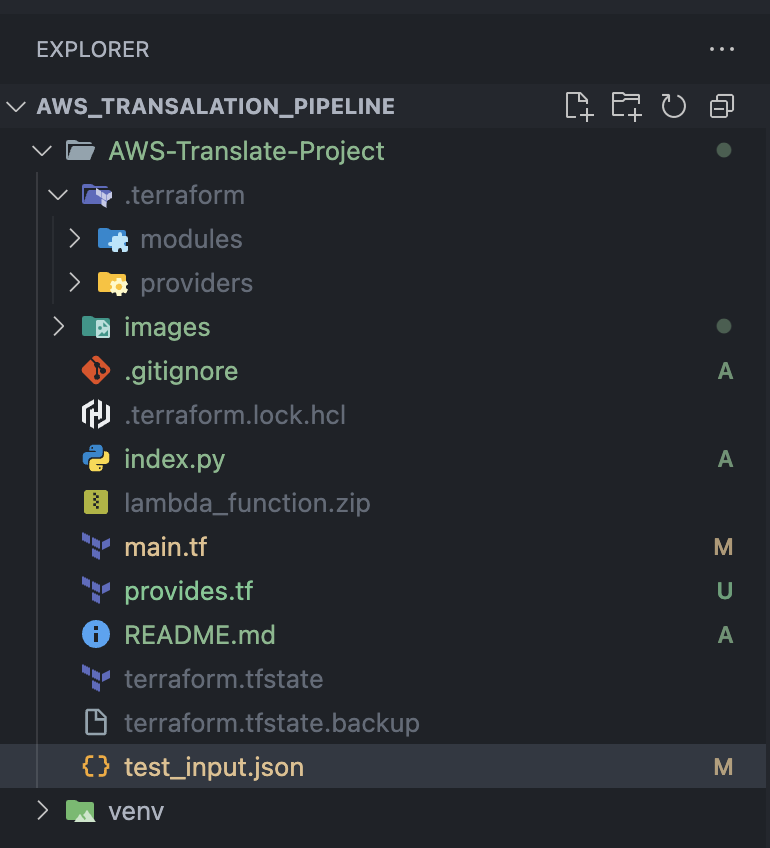{width="6.267716535433071in"
height="6.902777777777778in"}

Tools and resources

  -----------------------------------------------------------------------
  Component               Service/Tool            Purpose
  ----------------------- ----------------------- -----------------------
  Compute                 AWS Lambda              Serverless backend for
                                                  translation

  File Storage            Amazon s3               Input and Output
                                                  buckets

  IAM                     AWS IAM Roles/Policies  Secure access between
                                                  services

  Infrastructure          Terraform               IAC to deploy all
                                                  resources

  Monitoring              Cloudwatch              Lambda execution
                                                  logging

  Translation API         Amazon Translate        Actual Text translation
  -----------------------------------------------------------------------

### **IAM & Permissions**

The Lambda function has an IAM role that allows:

- translate: TranslateText

- s3:GetObject, s3:ListBucket on input bucket

- s3:PutObject on output bucket

- logs:\* for writing to CloudWatch

- 

### **Event Trigger Flow**

2.  A JSON file is uploaded to receiver-buck002.

3.  An **S3 event notification** triggers the lang-translator Lambda.

4.  Lambda reads the file and extracts translation fields.

5.  Uses Amazon Translate to translate text.

6.  Stores the result in taker-buck001.

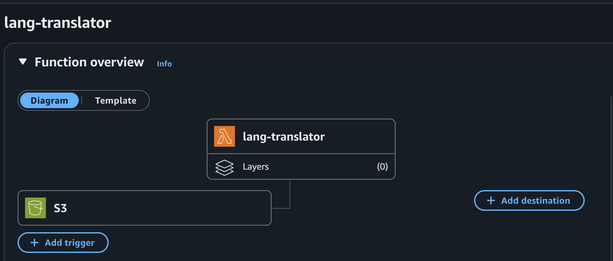{width="6.267716535433071in"
height="2.6805555555555554in"}

### **Sample Lambda Input Format**

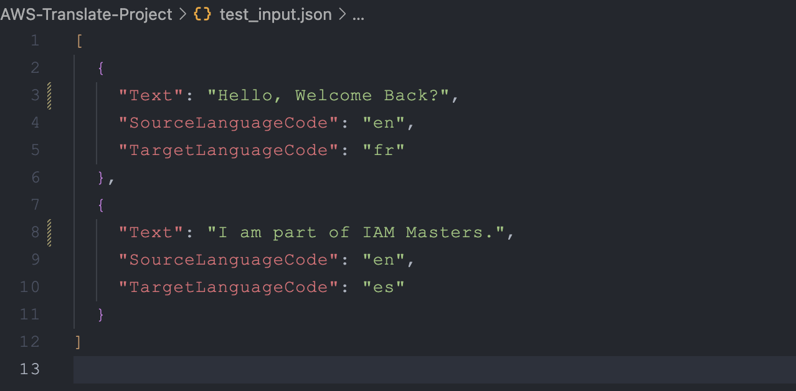{width="6.267716535433071in"
height="3.0833333333333335in"}

### **Sample Output File**

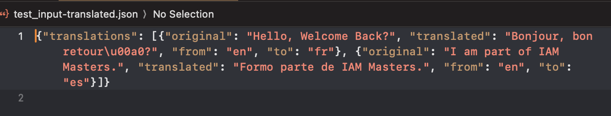{width="6.270833333333333in"
height="1.556233595800525in"}

### **How to Deploy**

1.  **Install Terraform**

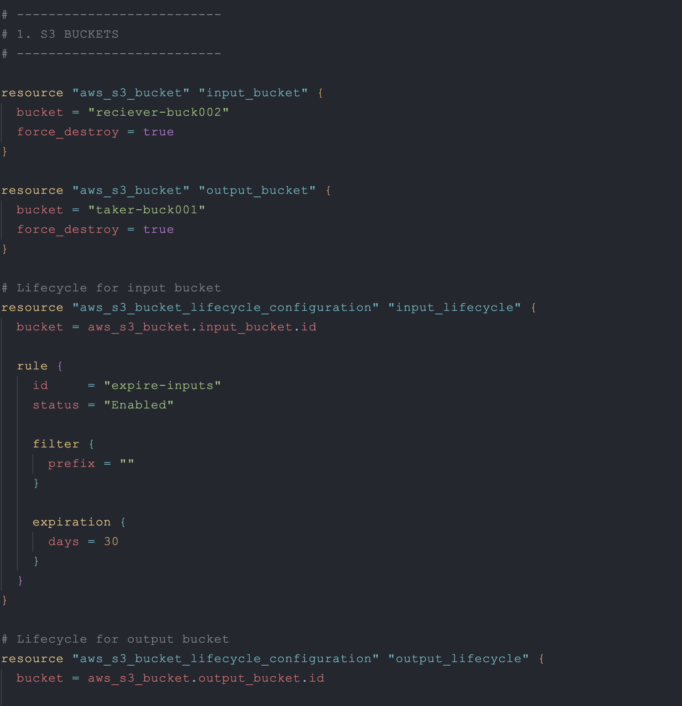{width="6.267716535433071in"
height="6.486111111111111in"}

terraform init

Terraform plan

4.  **Deploy to Lambda** via Terraform or manually.

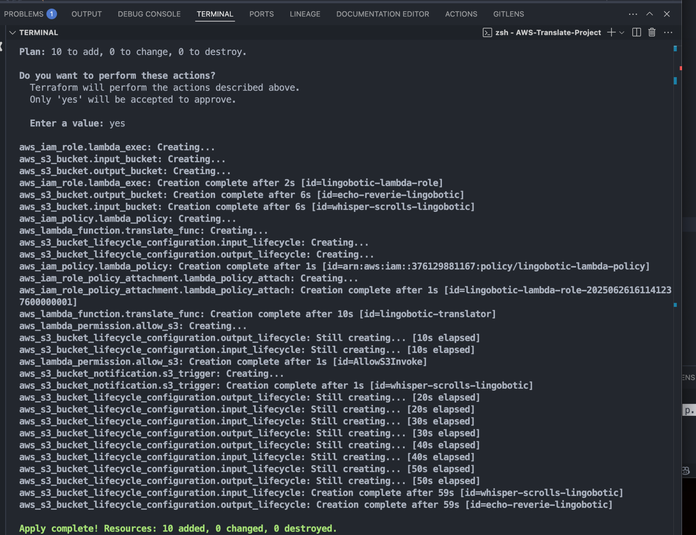{width="6.267716535433071in"
height="4.819444444444445in"}

zip lambda_function.zip [[index.py]{.underline}](http://index.py)

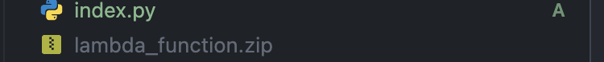{width="6.267716535433071in"
height="0.6527777777777778in"}

5.  Check if resources have been created, eg, buckets

> 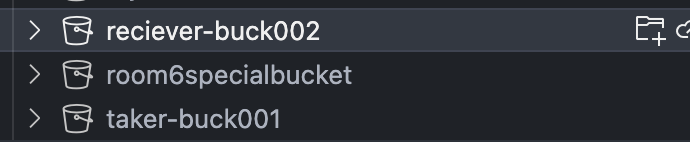{width="6.267716535433071in"
> height="1.2916666666666667in"}

6.  **Upload test file**:\
    aws s3 cp ../test/test_input.json s3://reciever-buck002/

### 

### **Monitoring**

- Use CloudWatch Logs:

> 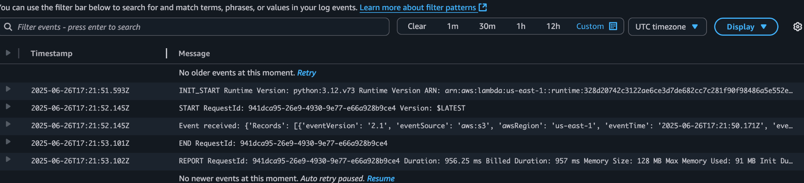{width="6.270833333333333in"
> height="1.8179779090113737in"}
>
> 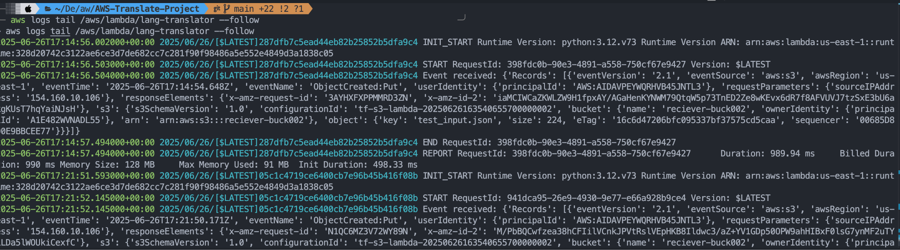{width="6.270833333333333in"
> height="2.5468022747156605in"}

### 

### **Future Improvements**

- Add SNS notifications on successful translation

- Add DynamoDB to store translation history

- Add a front-end upload interface

- Include language detection (if SourceLanguageCode is missing)

- Validate file content format before processing

Cleanup terraform destroy

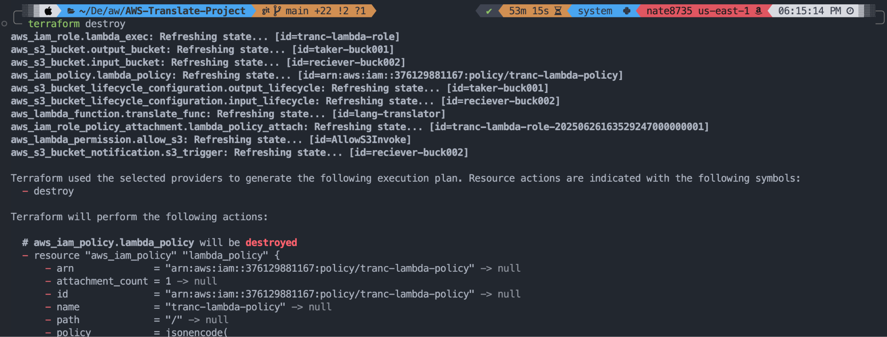{width="6.770833333333333in"
height="3.003549868766404in"}

### **IAM Masters**

**Nathaniel Sackey**

**Chrysolite Yeboah**

**Emmanuel Osei**

**Kelvin NeeQuaye**

**Eric Datsa**

**Mariam Zakiyu**

GitHub: [[Github
repo]{.underline}](https://github.com/bignate8735/transalation_pipeline)
