# AWS Automated Language Translation Pipeline (IaC with Terraform)

## 🚀 Project Overview

This project demonstrates a **fully serverless, event-driven translation pipeline** on AWS, powered by:

- **Amazon S3** (for input/output storage),
- **AWS Lambda** (for logic execution),
- **AWS Translate** (for real-time translation),
- All deployed via **Terraform Infrastructure as Code (IaC)**.

## 🧠 Workflow Summary

User uploads a JSON → Triggers S3 event → Lambda → AWS Translate → Output stored in response bucket

---

## 📂 Folder Structure

lingobotic-app/
│
├── main.tf                     # Terraform config
├── lambda_function.zip         # Zipped Lambda code
├── index.py                    # Your Lambda translation logic
├── sample_input/               # Sample test JSONs
│   └── sample_input_1.json
└── README.md                   # This file

---

## 📌 Key Objectives

1. Automate S3-triggered Lambda-based translation using AWS Translate.
2. Use Terraform to create:
   - S3 buckets with lifecycle policies
   - Lambda execution role with scoped IAM permissions
   - Lambda deployment from zip file
   - S3 event notification trigger for Lambda
3. Package and deploy Python-based Lambda zip
4. Log outputs to CloudWatch
5. Save translated files into a different S3 bucket

---

## ✅ Step-by-Step Setup

---

### **1. Prerequisites**

Ensure the following are installed:
- [AWS CLI](https://docs.aws.amazon.com/cli/latest/userguide/install-cliv2.html)
- [Terraform](https://developer.hashicorp.com/terraform/downloads)
- [Python 3.9+](https://www.python.org/downloads/)
- AWS credentials configured via `aws configure`

aws configure

### **2. Set a Unique Bucket Name Suffix**

In `main.tf`, edit:

```hcl
variable "bucket_name_suffix" {
  default = "your-unique-suffix" # e.g., lingobotic
}
```

markdown
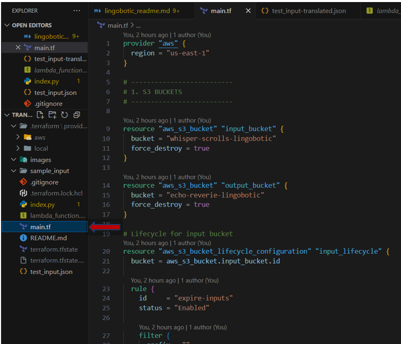


---

### **3. Create Lambda ZIP Package**

From your root directory:

```bash
Compress-Archive -Path index.py -DestinationPath lambda_function.zip
```

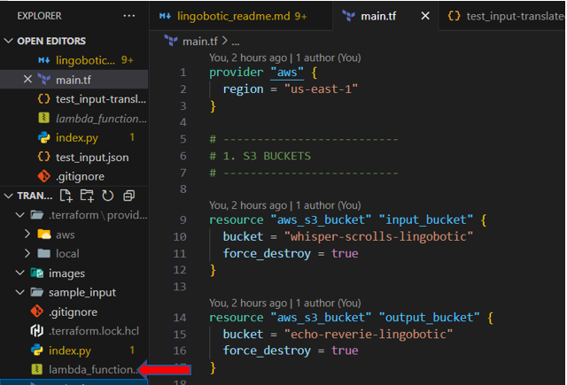

---

### **4. Initialize Terraform**

```bash
terraform init
```

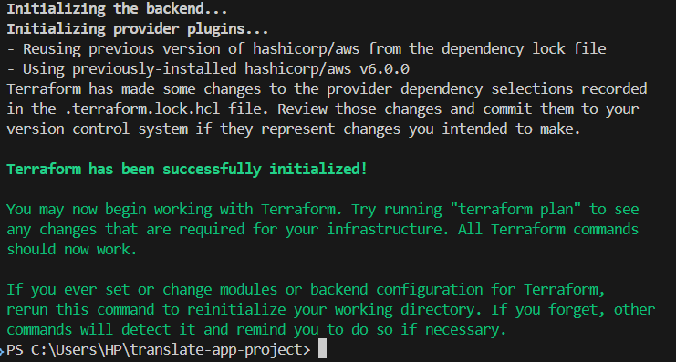

---

### **5. Validate Terraform Plan**

```bash
terraform plan
```

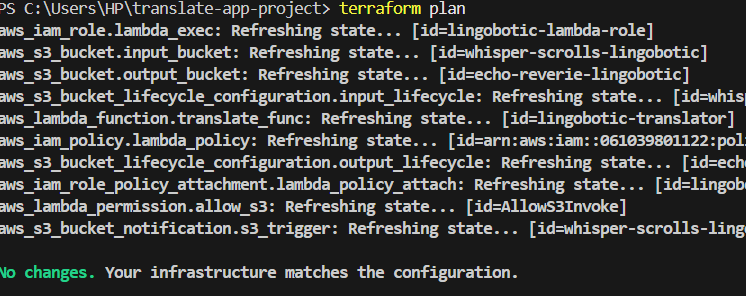

---

### **6. Deploy the Stack**

```bash
terraform apply
```

Type `yes` when prompted.
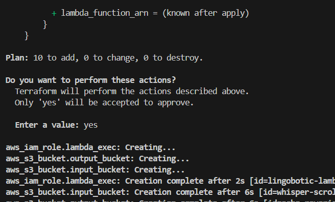

**Deployment Success:**
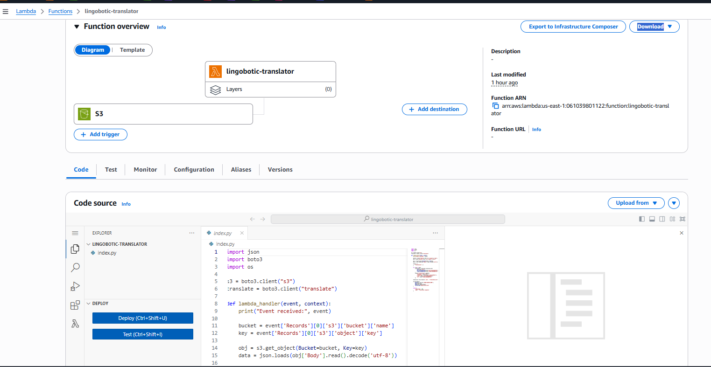
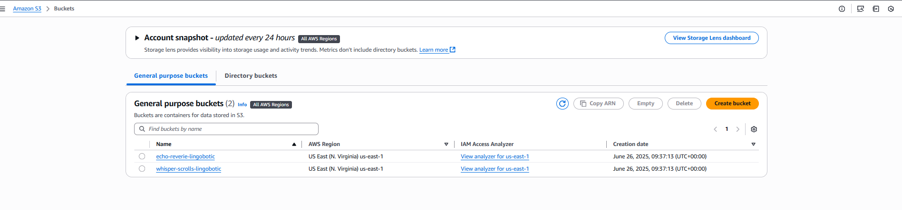
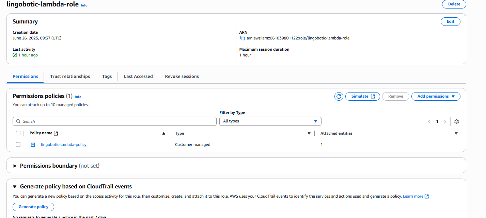

---

## 🔪 Testing the Translation Pipeline

---

### **7. Prepare Input JSON**

Create a sample input in `sample_input/sample_input_1.json`:

```json
[
  {
    "Text": "Hello world",
    "SourceLanguageCode": "en",
    "TargetLanguageCode": "fr"
  }
]
```

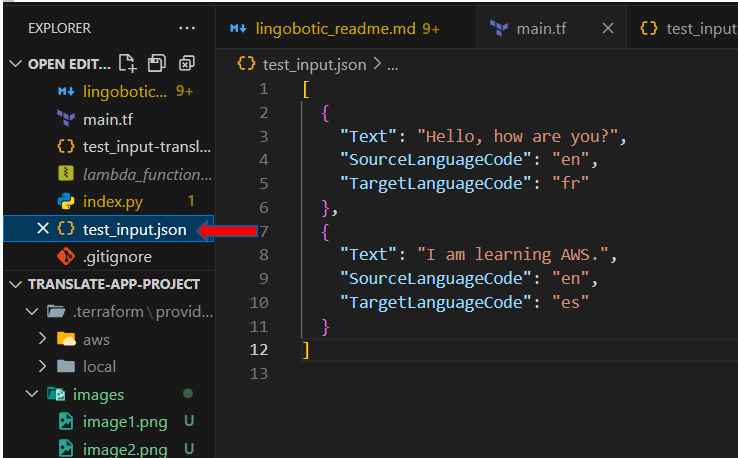

---

### **8. Upload to Request Bucket**

```bash
aws s3 cp sample_input/sample_input_1.json s3://whisper-scrolls-your-unique-suffix/input/sample_input_1.json
```

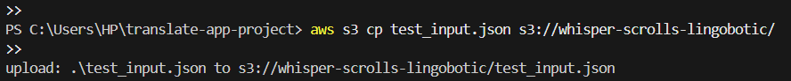

---

### **9. Check CloudWatch Logs**

Navigate to:

AWS Console → Lambda → Select Function → **Monitor** → **View logs in CloudWatch**

Look for logs with translated output.

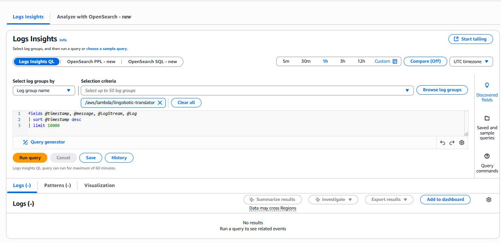
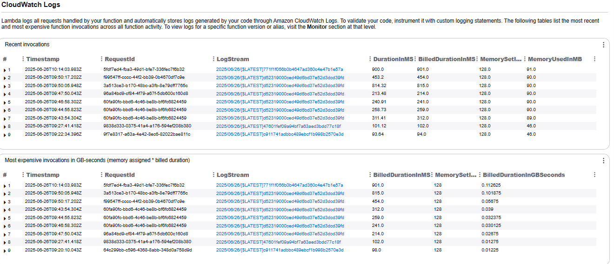


### **10. Verify Response Output**

Check your response bucket:
```bash
aws s3 ls s3://echo-reverie-your-unique-suffix/
```

Download the translated output:

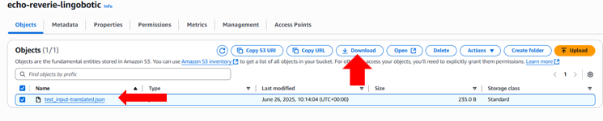

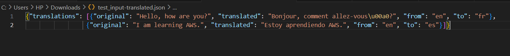

## 🛠️ Troubleshooting

- **Lambda not triggering?**
  - Confirm `aws_lambda_permission` exists in Terraform.
  - Ensure the input file is placed in the correct path and has `.json` suffix.

- **Runtime errors?**
  - Use CloudWatch Logs for stack traces and error details.

- **Translation not working?**
  - Check IAM policy allows: `translate:TranslateText`, `s3:GetObject`, `s3:PutObject`.

---

## 🪮 Cleanup Resources

```bash
aws s3 rm s3://whisper-scrolls-your-unique-suffix --recursive
aws s3 rm s3://echo-reverie-your-unique-suffix --recursive
terraform destroy
```

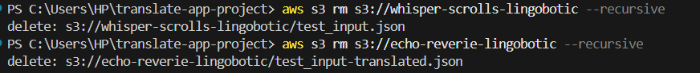
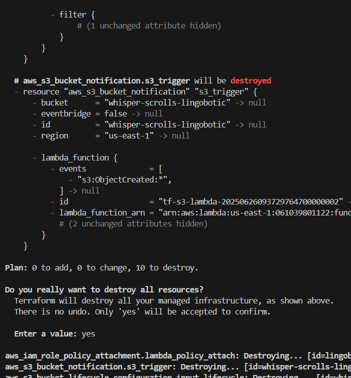

---

## 🐈 GitHub Setup (Optional)

To version control your project:

```bash
git init
git add .
git commit -m "Initial commit"
git remote add origin https://github.com/your_username/lingobotic-app.git
git push -u origin main
```

---

## ✅ Summary

You’ve successfully deployed a serverless, event-driven **translation pipeline** using:

- Amazon S3
- AWS Lambda
- AWS Translate
- IAM roles/policies
- Terraform (IaC)

This architecture is Free-Tier friendly and production-scalable 🚀

